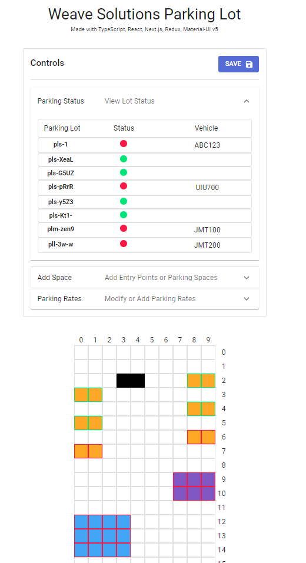
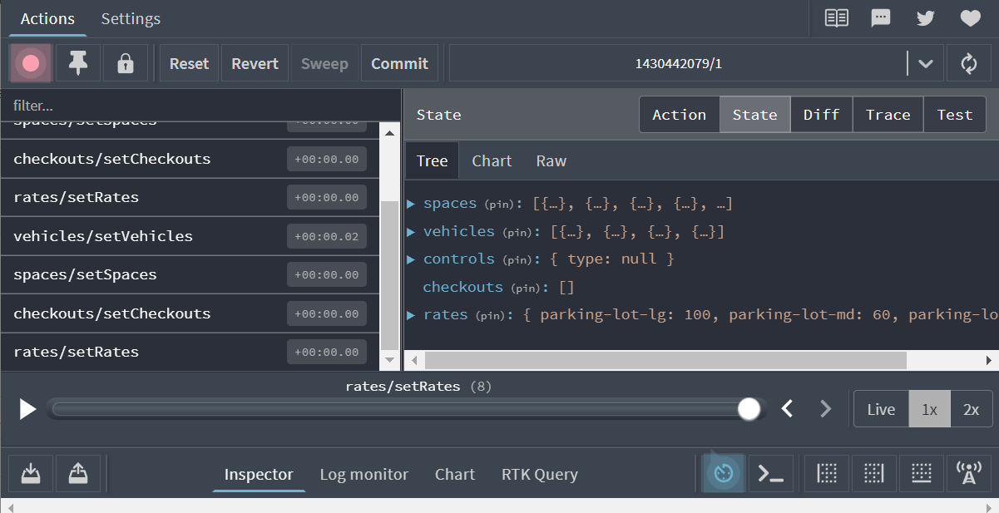

### Weave Solutions

#### Parking Lot Problem

> _time started: August 8, 3:00PM_

> _time submited: August 9, 4:00PM_

---

#### Technologies Utilized:

- TypeScript
- React
- Next.js
- Redux

---

#### How I tackled the problem

1. Created Next.js TypeScript Environment with Redux and MUI
2. Created a map or graph with x and y coordinates to build a plane, with that, the operator can add spaces or parking lot spaces.
3. Split global state into:
   - checkout
     - Handles recording of computed parking fees values
   - controls
     - Handles the x,y map if it should be prepared for handling adding of new spaces and entries
     - Caches selected coordinates and upon cancellation, discards them or dispatches action to add parking space to spaces state
   - spaces
     - Creates a record of spaces with its coordinates, id and categorization
   - vehicles
     - Stores vehicles parked and parking lot where it is parked
   - rates - Stores recording of rates based on spaces added
     > 

---

### Lacking Features:

1. Continuation of vehicle parking times when checked-out within an hour
2. Show Recording of Checkouts done

---

### Why use this approach?

    it allows for a more dynamic and flexible approach to adding variables such as parking lots and spaces, and it a graphical user interface of parking slots which is more realistic.

### Improvements and Fixes to be Made:

1. Validations
2. Component Optimizations
3. Removal of Parking Spaces

### Features

1. Redux manual persistence on localStorage
2. Autosave every 1s of current redux state
3. Somewhat Intuitive UI
